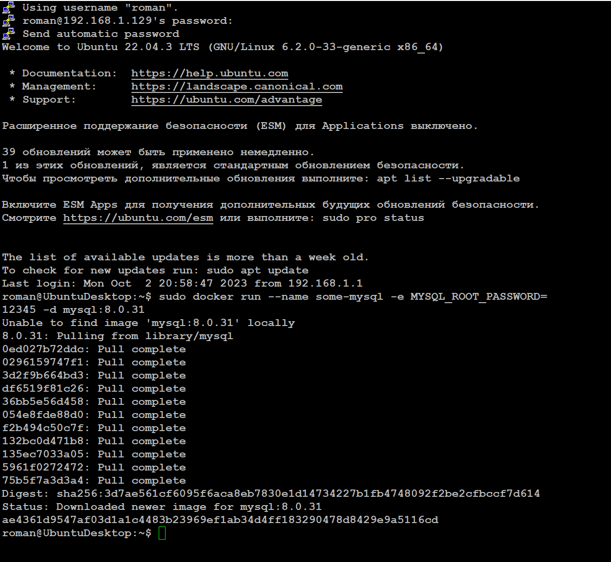
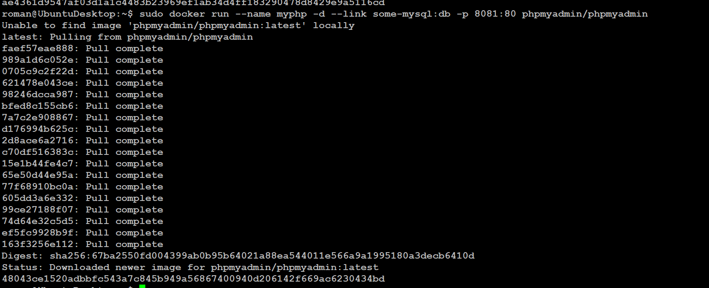

# ЗАДАЧА
Cоздать сервис, состоящий из 2 различных контейнеров: 1 - веб, 2 - БД (compose)

[Листинг консоли](hw5.txt)

# Задание со звездочкой - повышенной сложности..
Необходимо создать 3 сервиса в каждом окружении (dev, prod, lab)
по итогу на каждой ноде должно быть по 2 работающих контейнера

Создаем 3 ноды:

Инициализируем SWARM на главной ноде:

Добавляем остальные ноды как WORKER командой полученной при инициализации SWARM:

Смотрим список нод в SWARM

Смотрим список STACKов (стек по сути сборка наших сервисов в YAML файле)

Стеков нет.
Создаем YAML файлы для наших стеков:

Создаем директорию:

Создаем 3 YAML файла для наших стеков в разном окружении:

Деплоим стеки:

SWARM автоматически раскидал сервисы по нодам. Видим по 2 запущенных сервиса на каждой ноде.

Заходим в каждый стек по портам 6080, 6081, 6082 и создаем в каждом стеке свою базу данных:

